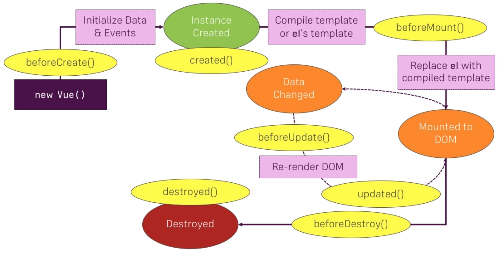

# 06 Vue Livecycle



```

new Vue({
  el: "#app",
  data: {
    title: "Hello World!",
  },
  beforeCreate: function () {
    console.log("before create");
  },
  created: function () {
    console.log("created");
  },
  beforeMount: function () {
    console.log("before mount");
  },
  mounted: function () {
		console.log("mounted");
	},
	beforeUpdate: function () {
		console.log("before update");
	},
	updated: function () {
		console.log("updated");
	},
	beforeDestroy: function () {
		console.log("before destroy");
	},
	destroyed: function () {
		console.log("destroyed");
	},
	methods: {
		destroy: function (){
			this.$destroy();
		}
	}
});


```